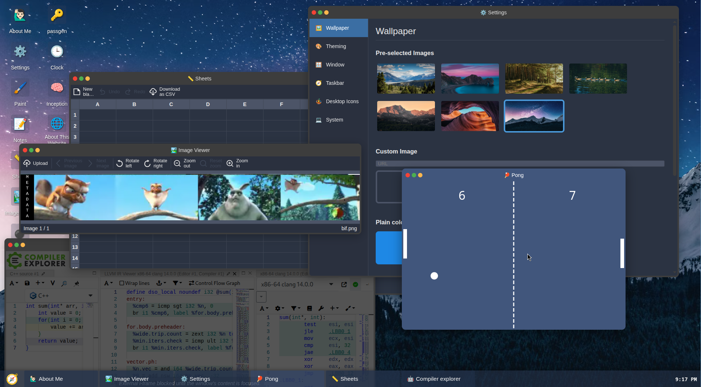

# Paul's Web Desktop

This is a desktop environment written in (Vanilla) JS, which also acts as my
personal page.
It is done with no external library nor dependency (besides a JS bundler to
produce efficient bundles).

_showing off my pong skills_

## Idea behind this project

It was started as yet another OS-like portfolio website, though I realized that
I was having too much fun implementing the desktop parts and that I didn't
actually want to work on the portfolio aspects of that website at all!

So I deviated from this by instead doing some kind of web desktop environment
proof-of-concept.

## Implementation choices

After playing with multiple ideas, I've taken the following technical choices
here that I find interesting:

- Applications and the desktop they run in are completely different codebases.

  Going a step further and serving apps from a different domain than the desktop
  allows parallelization and data isolation (thanks to a browser's cross-origin
  mechanisms), so that's what I do in my hosted demo for most of them.

  It means that most apps have no way to access what was not voluntarly
  provided to it and also that a frozen application does not hang the whole
  desktop, like it would without such isolation.

- I implemented a "filesystem", mostly backed by [IndexedDB](https://developer.mozilla.org/en-US/docs/Web/API/IndexedDB_API)-based
  storage.

  It is influenced by how things work on unix-like systems for familiarity
  reasons: the root directory is `/` with a "user" directory in it
  (`/userdata/`) and some directories with virtual files (not actually on
  disk, and computed at read time).

- Applications can receive arguments at launch (like file data and flags) and
  their code is loaded only when executed.

  Many of them are "sandboxed": Allowing not only to enforce a real and strong
  permission system (e.g. only a very few apps have access to the
  filesystem), but also efficient memory management, especially when
  opening and closing many apps in a single session.

- I ended up implementing an "executable" format: a JS object that can be
  serialized to JSON which contains metadata about the app and how to run it.

  The desktop actually runs applications by running those executables after
  reading them from the filesystem.

  This makes it possible to "install" applications (by adding them to the
  file system) and to let applications run other applications when they
  have the permission (e.g. the file explorer runs applications when you
  launch them from their location in the filesystem).

- As we're on the web platform, we do not have much control over memory and
  performance. At first I thought this would become ugly very quick but until
  now it seems to hold up pretty well with the following strategies:

  1. I tried to be very careful to avoid repaints at unwanted times, by
     choosing well the DOM API that I call, and by being careful in how I'm
     updating the DOM.

  2. When large rendering updates occur (e.g. during a window resize), I ensure
     that it needs to be re-rendered in JS before doing the updates (all in the
     same scheduled animation frame when possible).

  3. Complex animations are all done in CSS only.

  4. Memory-wise, I just try to be careful with event listeners, what data
     I keep around, and just stood memory conscious. Turns out the job
     of window management itself does not necessitate a lot of memory.

  5. I rely on the browser/user-agent for most things. They already implement
     very well a lot of the stuff needed and thus here do all the
     low-to-medium-level heavy lifting: CSS (an extremely expressive and capable
     tool), font/image rendering etc.

     Seeing the simplicity with which complex ideas could be quickly implemented
     efficiently is what dragged me to this rabbit hole of implementing a desktop.

- I implemented a common UI design for most base applications, which all respect
  JKJthe current theme chosen in the settings by relying on CSS variables.

- The icons in the desktop, the start menu, the taskbar and application windows
  (but not the application launcher relying on it) are all "components" with a
  simple enough API that could theoretically be implemented differently (e.g. a
  "dock" instead of a taskbar).

  I didn't give too much time yet on how this could be replaced though.

### Note on keyboard shortcuts

I'm still unsure of how to do keyboard shortcuts, as we're running on top of an
environment with already its fair share of it: the OS, the browser, and
maybe browser extensions (as a vimium user, I heavily dislike websites catching
random keys!). Also, the page could theoretically run in all kind of devices
with different interfaces (keyboard, touch, TV remote, game controller...).

For now, I only "catch" keys when it should be obvious (Escape key to abort
some stuff, navigation keys in some situations...), but keyboard shortcuts are
so linked to window managers that I think I'll need to work more on it at
some point.

My current idea is to just let the user declare them in the "settings app"
(not done yet).
